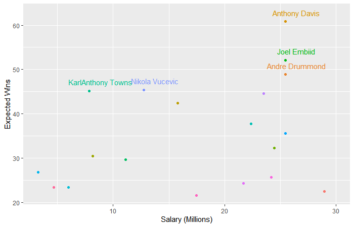

<center>
{width=300px}

</center>
---

## Overall
- In the most recent NBA *season (2018-19)*, Chicago Bulls placed *27th out of 30* (for win-loss record). 
- The budget for player contracts next season is ***$118 million***.
- The team's expected ranking in the *2019-20 NBA Season* is ***ranked 26th out of 30 ***.

---

## Aims of This Project
- Helping Chicago Bulls find the best five starting players for *Each Position*
 (Point Guard, Shooting Guard, Small Forward, Power Forward and Center).
- Make sure the money will not be use up on just these five players.
- These 5 players should have the ability to help the team achieve the desired goal *Ranked 26 out of 30*

---

## Data Source

1. 2018-19_nba_player_statistics.csv: sourced from [basketball-reference.com](https://www.basketball-reference.com/leagues/NBA_2019_totals.html)
2. 2018-19_nba_player-salaries.csv: sourced from [hoopshype.com/salaries](https://hoopshype.com/salaries/)
3. 2019-20_nba_team-payroll.csv: sourced from [hoopshype.com/salaries](https://hoopshype.com/salaries/)
4. 2018-19_nba_team-statistics_1.csv: sourced from [basketball-reference.com](https://www.basketball-reference.com/leagues/NBA_2019.html)
5. 2018-19_nba_team-statistics_2.csv: sourced from [basketball-reference.com](https://www.basketball-reference.com/leagues/NBA_2019.html)

---

## Method


---

## Model Testing (Expected Wins vs Wins)

```{r Setup, include=FALSE}
knitr::opts_chunk$set(warning = FALSE, message = FALSE, echo = FALSE, fig.align = 'center')
```

````{r Model_Testing}
library(tidyverse)
library(broom)
library(car)
library(ggplot2)
team <- read_csv( "data/processed/3_All_Teams_Infor_Per_G.csv" )

fit_t <- lm( W ~  PTS_Per_G + STL_Per_G + AST_Per_G + TRB_Per_G + BLK_Per_G +TOV_Per_G , data = team)

knitr::kable(tidy(fit_t, conf.int = TRUE))

team <- team %>%
  mutate(exp_t_w = predict(fit_t))

ggplot(team, aes(exp_t_w, W, label = Team)) + 
  geom_point(colour = "dodgerblue") + 
  geom_text(nudge_x = 2, nudge_y = 1.5, cex = 2.5) + 
  geom_abline( colour = "red")+
  xlab("Expect Wins")+
  ylab("Wins")
```

The points in the figure are close to the regression line, so the multiple regression model is accurate.

## Result

### Staring Player of Center

```{r Load_player_data}
player2 <- read_csv("data/processed/4_Regression_Player2.csv") 

#Divide Players by Positions

C <- player2 %>%
  filter(Pos == "C")
PF <- player2 %>%
  filter(Pos == "PF") 
PG <- player2 %>%
  filter(Pos == "PG")
SF <- player2 %>%
  filter(Pos == "SF")
SG <- player2 %>%
  filter(Pos == "SG")

##since we need 5 staring players for each position. We need to do regress individually.

###Staring Player of Center

knitr::kable(head(C))

```




From the charts and figures, it can be found that the most skilled center is Anthony Davis, while his salary is also quite high.

By comparing the top 6 skilled centers, Karl Anthony Towns is the one with the highest price-performance ratio. We can put **KarlAnthony Towns** as the first choice.

---

### Staring Player of Power Forward

```{r pf}
knitr::kable(head(PF))

PF %>%
  ggplot(aes(x = salary, y = exp_t_wA, color = player_name)) +
  geom_point() + 
  geom_text(aes(label=ifelse(exp_t_wA > 30,as.character(player_name),'')),
            nudge_x = 2,nudge_y = 2) +
  theme(legend.position = "none")+
  xlab("Salary (Millions)") +
  ylab("Expected Wins")
```

Giannis Antetokounmpo's Adjusted Expected Wins Index is the highest in power forward,and is 60% higher than the second place (John Collins). 

But our goal is 26 out of 30, so we do not need to choose a player who with the highest ability. In addition, his salary is too high to our team.

Therefore, we can choose **John Collins** who is in second place. He is good enough for our goal in 2019-2020 Season (26 out of 30), and the salary is also affordable.

---

### Staring Player of Small Forward

```{r sf}
knitr::kable(head(SF))

SF %>%
  ggplot(aes(x = salary, y = exp_t_wA, color = player_name)) +
  geom_point() + 
  geom_text(aes(label=ifelse(exp_t_wA > 33,as.character(player_name),'')),
            nudge_x = -1) +
  theme(legend.position = "none")+
  xlab("Salary (Millions)") +
  ylab("Expected Wins")
```

Kawhi Leonard's expected wins index is only slightly lower than Paul George, but his salary is less than  Paul almost 7 millions, so **Kawhi Leonard** is more valued and suit for us.

---

### Staring Player of Point Guard
```{r pg}
knitr::kable(head(PG))

PG %>%
  ggplot(aes(x = salary, y = exp_t_wA, color = player_name)) +
  geom_point() + 
  geom_text(aes(label=ifelse(exp_t_wA > 30,as.character(player_name),'')),
            nudge_x = -3) +
  theme(legend.position = "none")+
  xlab("Salary (Millions)") +
  ylab("Expected Wins")
```

**James Harden** is the player with the highest adjusted expected wins index in the power guard, and also the most cost-effective PG who can assist the team to achieve goal. 

A good shooting guard is essential for a team. They are regarded as leaders on the field [Wikipedia](https://en.wikipedia.org/wiki/Basketball_positions). 

They can mobilize all players, implement tactics and provide assists, and they also can offense and score by themselves. In addition, having a good shooting guard can facilitate other players have a clearer idea during the games. Therefore, it is worth to spent more money on this position.

---

### Staring Player of Shooting Guard

```{r sg}
knitr::kable(head(SG))

SG %>%
  ggplot(aes(x = salary, y = exp_t_wA, color = player_name)) +
  geom_point() + 
  geom_text(aes(label=ifelse(exp_t_wA > 22.3 ,as.character(player_name),'')),
            nudge_x = -2) +
  theme(legend.position = "none")+
  xlab("Salary (Millions)") +
  ylab("Expected Wins")
```

**Luka Doncic** is the best Shooting Guards for Chicago Bulls. 
His expected wins index is 22.6, but his salary is only 6.57 million.

---

## Final Staring Players List

```{r final_list}

final <- read_csv("data/processed/final_player_list.csv")
knitr::kable(final)

```


I recommend these five players as Chicago Bulls staring players in new season. 

There is one player in each position, and their ***total salary*** is ***70.39 million*** , accounting for ***59.3%*** of the total budget. 

There is enough budget for filling the full team roster. And these players deserve these salaries based on their abilities.


